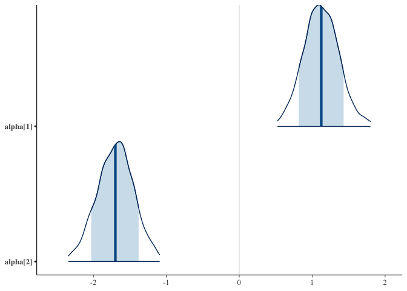

The Titanic Kaggle Challenge
================
Chris Bemben
9/5/2020

## Overview

Details of this Kaggle challenge can be found
[here](https://www.kaggle.com/c/titanic), the challenge is to accurately
predict whether a passenger survived the shipwreck or not. The response
variable is binary and since a passenger cannot partially survive the
response variable will be either 1 or 0. This document will use the
[Stan](https://mc-stan.org/) programming language and logistic
regression to attack the challenge.

``` r
library(rstan)
library(rstanarm)
library(magrittr)
library(ggplot2)
library(titanic)
library(bayesplot)

train <- titanic::titanic_train
test <- titanic::titanic_test

train_idx <- sample(nrow(train), nrow(train)*0.8)
test_idx <- setdiff(seq_len(nrow(train)), train_idx)

str(train)
```

    ## 'data.frame':    891 obs. of  12 variables:
    ##  $ PassengerId: int  1 2 3 4 5 6 7 8 9 10 ...
    ##  $ Survived   : int  0 1 1 1 0 0 0 0 1 1 ...
    ##  $ Pclass     : int  3 1 3 1 3 3 1 3 3 2 ...
    ##  $ Name       : Factor w/ 891 levels "Abbing, Mr. Anthony",..: 109 191 358 277 16 559 520 629 417 581 ...
    ##  $ Sex        : Factor w/ 2 levels "female","male": 2 1 1 1 2 2 2 2 1 1 ...
    ##  $ Age        : num  22 38 26 35 35 NA 54 2 27 14 ...
    ##  $ SibSp      : int  1 1 0 1 0 0 0 3 0 1 ...
    ##  $ Parch      : int  0 0 0 0 0 0 0 1 2 0 ...
    ##  $ Ticket     : Factor w/ 681 levels "110152","110413",..: 524 597 670 50 473 276 86 396 345 133 ...
    ##  $ Fare       : num  7.25 71.28 7.92 53.1 8.05 ...
    ##  $ Cabin      : Factor w/ 148 levels "","A10","A14",..: 1 83 1 57 1 1 131 1 1 1 ...
    ##  $ Embarked   : Factor w/ 4 levels "","C","Q","S": 4 2 4 4 4 3 4 4 4 2 ...

It’s a common anecdote that women and children were the first passengers
saved so the first model will only use age and gender as predictors.
Since there is a substantial number of missing age values, nulls will be
imputed, see the `Impute Passenger Age` function for the details of the
imputation methodology or the `Exploratory Data Analysis` vignette to
see the before after.

``` r
train <- titanic::impute_passenger_age(train)
test <- titanic:: impute_passenger_age(test)
```

The `Stan` program fits the model but also accepts a test dataset which
will be used to make predictions. For more details on this approach see
the `Stan`
[manual](https://mc-stan.org/docs/2_24/stan-users-guide/prediction-forecasting-and-backcasting.html).

``` r
simple_model <- titanic::age_gender_stan(
                                          #N=nrow(train[train_idx,]),
                                          age=train[train_idx,'Age'],
                                          sex=2,
                                          sex_idx=as.integer(train[train_idx,'Sex']),
                                          survived=train[train_idx,'Survived'],
                                          #test_N=nrow(train[test_idx,]),
                                          test_age=train[test_idx,'Age'],
                                          test_sex_idx=as.integer(train[test_idx,'Sex']), seed=1234)
```

    ## 
    ## SAMPLING FOR MODEL 'age_gender_model' NOW (CHAIN 1).
    ## Chain 1: 
    ## Chain 1: Gradient evaluation took 8.9e-05 seconds
    ## Chain 1: 1000 transitions using 10 leapfrog steps per transition would take 0.89 seconds.
    ## Chain 1: Adjust your expectations accordingly!
    ## Chain 1: 
    ## Chain 1: 
    ## Chain 1: Iteration:    1 / 2000 [  0%]  (Warmup)
    ## Chain 1: Iteration:  200 / 2000 [ 10%]  (Warmup)
    ## Chain 1: Iteration:  400 / 2000 [ 20%]  (Warmup)
    ## Chain 1: Iteration:  600 / 2000 [ 30%]  (Warmup)
    ## Chain 1: Iteration:  800 / 2000 [ 40%]  (Warmup)
    ## Chain 1: Iteration: 1000 / 2000 [ 50%]  (Warmup)
    ## Chain 1: Iteration: 1001 / 2000 [ 50%]  (Sampling)
    ## Chain 1: Iteration: 1200 / 2000 [ 60%]  (Sampling)
    ## Chain 1: Iteration: 1400 / 2000 [ 70%]  (Sampling)
    ## Chain 1: Iteration: 1600 / 2000 [ 80%]  (Sampling)
    ## Chain 1: Iteration: 1800 / 2000 [ 90%]  (Sampling)
    ## Chain 1: Iteration: 2000 / 2000 [100%]  (Sampling)
    ## Chain 1: 
    ## Chain 1:  Elapsed Time: 1.39899 seconds (Warm-up)
    ## Chain 1:                0.57379 seconds (Sampling)
    ## Chain 1:                1.97278 seconds (Total)
    ## Chain 1: 
    ## 
    ## SAMPLING FOR MODEL 'age_gender_model' NOW (CHAIN 2).
    ## Chain 2: 
    ## Chain 2: Gradient evaluation took 5.7e-05 seconds
    ## Chain 2: 1000 transitions using 10 leapfrog steps per transition would take 0.57 seconds.
    ## Chain 2: Adjust your expectations accordingly!
    ## Chain 2: 
    ## Chain 2: 
    ## Chain 2: Iteration:    1 / 2000 [  0%]  (Warmup)
    ## Chain 2: Iteration:  200 / 2000 [ 10%]  (Warmup)
    ## Chain 2: Iteration:  400 / 2000 [ 20%]  (Warmup)
    ## Chain 2: Iteration:  600 / 2000 [ 30%]  (Warmup)
    ## Chain 2: Iteration:  800 / 2000 [ 40%]  (Warmup)
    ## Chain 2: Iteration: 1000 / 2000 [ 50%]  (Warmup)
    ## Chain 2: Iteration: 1001 / 2000 [ 50%]  (Sampling)
    ## Chain 2: Iteration: 1200 / 2000 [ 60%]  (Sampling)
    ## Chain 2: Iteration: 1400 / 2000 [ 70%]  (Sampling)
    ## Chain 2: Iteration: 1600 / 2000 [ 80%]  (Sampling)
    ## Chain 2: Iteration: 1800 / 2000 [ 90%]  (Sampling)
    ## Chain 2: Iteration: 2000 / 2000 [100%]  (Sampling)
    ## Chain 2: 
    ## Chain 2:  Elapsed Time: 1.50607 seconds (Warm-up)
    ## Chain 2:                0.574096 seconds (Sampling)
    ## Chain 2:                2.08017 seconds (Total)
    ## Chain 2: 
    ## 
    ## SAMPLING FOR MODEL 'age_gender_model' NOW (CHAIN 3).
    ## Chain 3: 
    ## Chain 3: Gradient evaluation took 5.3e-05 seconds
    ## Chain 3: 1000 transitions using 10 leapfrog steps per transition would take 0.53 seconds.
    ## Chain 3: Adjust your expectations accordingly!
    ## Chain 3: 
    ## Chain 3: 
    ## Chain 3: Iteration:    1 / 2000 [  0%]  (Warmup)
    ## Chain 3: Iteration:  200 / 2000 [ 10%]  (Warmup)
    ## Chain 3: Iteration:  400 / 2000 [ 20%]  (Warmup)
    ## Chain 3: Iteration:  600 / 2000 [ 30%]  (Warmup)
    ## Chain 3: Iteration:  800 / 2000 [ 40%]  (Warmup)
    ## Chain 3: Iteration: 1000 / 2000 [ 50%]  (Warmup)
    ## Chain 3: Iteration: 1001 / 2000 [ 50%]  (Sampling)
    ## Chain 3: Iteration: 1200 / 2000 [ 60%]  (Sampling)
    ## Chain 3: Iteration: 1400 / 2000 [ 70%]  (Sampling)
    ## Chain 3: Iteration: 1600 / 2000 [ 80%]  (Sampling)
    ## Chain 3: Iteration: 1800 / 2000 [ 90%]  (Sampling)
    ## Chain 3: Iteration: 2000 / 2000 [100%]  (Sampling)
    ## Chain 3: 
    ## Chain 3:  Elapsed Time: 1.31486 seconds (Warm-up)
    ## Chain 3:                0.632713 seconds (Sampling)
    ## Chain 3:                1.94757 seconds (Total)
    ## Chain 3: 
    ## 
    ## SAMPLING FOR MODEL 'age_gender_model' NOW (CHAIN 4).
    ## Chain 4: 
    ## Chain 4: Gradient evaluation took 6.1e-05 seconds
    ## Chain 4: 1000 transitions using 10 leapfrog steps per transition would take 0.61 seconds.
    ## Chain 4: Adjust your expectations accordingly!
    ## Chain 4: 
    ## Chain 4: 
    ## Chain 4: Iteration:    1 / 2000 [  0%]  (Warmup)
    ## Chain 4: Iteration:  200 / 2000 [ 10%]  (Warmup)
    ## Chain 4: Iteration:  400 / 2000 [ 20%]  (Warmup)
    ## Chain 4: Iteration:  600 / 2000 [ 30%]  (Warmup)
    ## Chain 4: Iteration:  800 / 2000 [ 40%]  (Warmup)
    ## Chain 4: Iteration: 1000 / 2000 [ 50%]  (Warmup)
    ## Chain 4: Iteration: 1001 / 2000 [ 50%]  (Sampling)
    ## Chain 4: Iteration: 1200 / 2000 [ 60%]  (Sampling)
    ## Chain 4: Iteration: 1400 / 2000 [ 70%]  (Sampling)
    ## Chain 4: Iteration: 1600 / 2000 [ 80%]  (Sampling)
    ## Chain 4: Iteration: 1800 / 2000 [ 90%]  (Sampling)
    ## Chain 4: Iteration: 2000 / 2000 [100%]  (Sampling)
    ## Chain 4: 
    ## Chain 4:  Elapsed Time: 1.40404 seconds (Warm-up)
    ## Chain 4:                0.570615 seconds (Sampling)
    ## Chain 4:                1.97466 seconds (Total)
    ## Chain 4:

The model estimates an intercept for each `Sex` separately but shares
the coefficient on age. The prior on `beta` is a standard normal
distribution centered at 0 with a standard deviation of 1.

``` r
print(simple_model, pars=c('alpha','beta'))
```

    ## Inference for Stan model: age_gender_model.
    ## 4 chains, each with iter=2000; warmup=1000; thin=1; 
    ## post-warmup draws per chain=1000, total post-warmup draws=4000.
    ## 
    ##           mean se_mean   sd  2.5%   25%   50%   75% 97.5% n_eff Rhat
    ## alpha[1]  1.05    0.01 0.23  0.61  0.89  1.05  1.21  1.50  1019    1
    ## alpha[2] -1.36    0.01 0.24 -1.83 -1.52 -1.35 -1.20 -0.88   998    1
    ## beta      0.00    0.00 0.01 -0.01 -0.01  0.00  0.00  0.01   972    1
    ## 
    ## Samples were drawn using NUTS(diag_e) at Mon Oct  5 18:07:46 2020.
    ## For each parameter, n_eff is a crude measure of effective sample size,
    ## and Rhat is the potential scale reduction factor on split chains (at 
    ## convergence, Rhat=1).

Gender has a big impact on survival.

``` r
samp <- rstan::extract(simple_model)

mcmc_areas(
  simple_model, 
  pars = c("alpha[1]","alpha[2]"),
  prob = 0.8, # 80% intervals
  prob_outer = 0.99, # 99%
  point_est = "mean"
)
```

<!-- -->

``` r
post_pred_df <- as.data.frame(samp$y_new)
bayesplot::ppc_stat(y = train[test_idx,"Survived"], yrep = as.matrix(post_pred_df), stat = mean)
```

    ## `stat_bin()` using `bins = 30`. Pick better value with `binwidth`.

<!-- -->

The plot above is comparing the predictions to the actual mean of the
test dataset. Overall the model does a good job of estimating the
survival rate but individual predictions are still in need of review and
for the Kaggle challenge we care about accuracy.

``` r
mean(apply(samp$y_new, 2, median) %>% round(0) == train[test_idx,'Survived'])
```

    ## [1] 0.8379888

Accuracy against a test set is about 0.8379888 percent. There seems to
be more to the story we need to consider to improve accuracy to a
reasonable level.

Predict on the Kaggle challenge test set.

``` r
predict_model <- titanic::age_gender_stan(age=train[train_idx,'Age'],
                                          sex=2,
                                          sex_idx=as.integer(train[train_idx,'Sex']),
                                          survived=train[train_idx,'Survived'],
                                          test_age=test$Age,
                                          test_sex_idx=as.integer(test$Sex)
                                         , seed=1234
                                         )
```

    ## 
    ## SAMPLING FOR MODEL 'age_gender_model' NOW (CHAIN 1).
    ## Chain 1: 
    ## Chain 1: Gradient evaluation took 6e-05 seconds
    ## Chain 1: 1000 transitions using 10 leapfrog steps per transition would take 0.6 seconds.
    ## Chain 1: Adjust your expectations accordingly!
    ## Chain 1: 
    ## Chain 1: 
    ## Chain 1: Iteration:    1 / 2000 [  0%]  (Warmup)
    ## Chain 1: Iteration:  200 / 2000 [ 10%]  (Warmup)
    ## Chain 1: Iteration:  400 / 2000 [ 20%]  (Warmup)
    ## Chain 1: Iteration:  600 / 2000 [ 30%]  (Warmup)
    ## Chain 1: Iteration:  800 / 2000 [ 40%]  (Warmup)
    ## Chain 1: Iteration: 1000 / 2000 [ 50%]  (Warmup)
    ## Chain 1: Iteration: 1001 / 2000 [ 50%]  (Sampling)
    ## Chain 1: Iteration: 1200 / 2000 [ 60%]  (Sampling)
    ## Chain 1: Iteration: 1400 / 2000 [ 70%]  (Sampling)
    ## Chain 1: Iteration: 1600 / 2000 [ 80%]  (Sampling)
    ## Chain 1: Iteration: 1800 / 2000 [ 90%]  (Sampling)
    ## Chain 1: Iteration: 2000 / 2000 [100%]  (Sampling)
    ## Chain 1: 
    ## Chain 1:  Elapsed Time: 1.18091 seconds (Warm-up)
    ## Chain 1:                0.624165 seconds (Sampling)
    ## Chain 1:                1.80508 seconds (Total)
    ## Chain 1: 
    ## 
    ## SAMPLING FOR MODEL 'age_gender_model' NOW (CHAIN 2).
    ## Chain 2: 
    ## Chain 2: Gradient evaluation took 5.3e-05 seconds
    ## Chain 2: 1000 transitions using 10 leapfrog steps per transition would take 0.53 seconds.
    ## Chain 2: Adjust your expectations accordingly!
    ## Chain 2: 
    ## Chain 2: 
    ## Chain 2: Iteration:    1 / 2000 [  0%]  (Warmup)
    ## Chain 2: Iteration:  200 / 2000 [ 10%]  (Warmup)
    ## Chain 2: Iteration:  400 / 2000 [ 20%]  (Warmup)
    ## Chain 2: Iteration:  600 / 2000 [ 30%]  (Warmup)
    ## Chain 2: Iteration:  800 / 2000 [ 40%]  (Warmup)
    ## Chain 2: Iteration: 1000 / 2000 [ 50%]  (Warmup)
    ## Chain 2: Iteration: 1001 / 2000 [ 50%]  (Sampling)
    ## Chain 2: Iteration: 1200 / 2000 [ 60%]  (Sampling)
    ## Chain 2: Iteration: 1400 / 2000 [ 70%]  (Sampling)
    ## Chain 2: Iteration: 1600 / 2000 [ 80%]  (Sampling)
    ## Chain 2: Iteration: 1800 / 2000 [ 90%]  (Sampling)
    ## Chain 2: Iteration: 2000 / 2000 [100%]  (Sampling)
    ## Chain 2: 
    ## Chain 2:  Elapsed Time: 1.31133 seconds (Warm-up)
    ## Chain 2:                0.565527 seconds (Sampling)
    ## Chain 2:                1.87686 seconds (Total)
    ## Chain 2: 
    ## 
    ## SAMPLING FOR MODEL 'age_gender_model' NOW (CHAIN 3).
    ## Chain 3: 
    ## Chain 3: Gradient evaluation took 5.5e-05 seconds
    ## Chain 3: 1000 transitions using 10 leapfrog steps per transition would take 0.55 seconds.
    ## Chain 3: Adjust your expectations accordingly!
    ## Chain 3: 
    ## Chain 3: 
    ## Chain 3: Iteration:    1 / 2000 [  0%]  (Warmup)
    ## Chain 3: Iteration:  200 / 2000 [ 10%]  (Warmup)
    ## Chain 3: Iteration:  400 / 2000 [ 20%]  (Warmup)
    ## Chain 3: Iteration:  600 / 2000 [ 30%]  (Warmup)
    ## Chain 3: Iteration:  800 / 2000 [ 40%]  (Warmup)
    ## Chain 3: Iteration: 1000 / 2000 [ 50%]  (Warmup)
    ## Chain 3: Iteration: 1001 / 2000 [ 50%]  (Sampling)
    ## Chain 3: Iteration: 1200 / 2000 [ 60%]  (Sampling)
    ## Chain 3: Iteration: 1400 / 2000 [ 70%]  (Sampling)
    ## Chain 3: Iteration: 1600 / 2000 [ 80%]  (Sampling)
    ## Chain 3: Iteration: 1800 / 2000 [ 90%]  (Sampling)
    ## Chain 3: Iteration: 2000 / 2000 [100%]  (Sampling)
    ## Chain 3: 
    ## Chain 3:  Elapsed Time: 1.19638 seconds (Warm-up)
    ## Chain 3:                0.590815 seconds (Sampling)
    ## Chain 3:                1.78719 seconds (Total)
    ## Chain 3: 
    ## 
    ## SAMPLING FOR MODEL 'age_gender_model' NOW (CHAIN 4).
    ## Chain 4: 
    ## Chain 4: Gradient evaluation took 6.1e-05 seconds
    ## Chain 4: 1000 transitions using 10 leapfrog steps per transition would take 0.61 seconds.
    ## Chain 4: Adjust your expectations accordingly!
    ## Chain 4: 
    ## Chain 4: 
    ## Chain 4: Iteration:    1 / 2000 [  0%]  (Warmup)
    ## Chain 4: Iteration:  200 / 2000 [ 10%]  (Warmup)
    ## Chain 4: Iteration:  400 / 2000 [ 20%]  (Warmup)
    ## Chain 4: Iteration:  600 / 2000 [ 30%]  (Warmup)
    ## Chain 4: Iteration:  800 / 2000 [ 40%]  (Warmup)
    ## Chain 4: Iteration: 1000 / 2000 [ 50%]  (Warmup)
    ## Chain 4: Iteration: 1001 / 2000 [ 50%]  (Sampling)
    ## Chain 4: Iteration: 1200 / 2000 [ 60%]  (Sampling)
    ## Chain 4: Iteration: 1400 / 2000 [ 70%]  (Sampling)
    ## Chain 4: Iteration: 1600 / 2000 [ 80%]  (Sampling)
    ## Chain 4: Iteration: 1800 / 2000 [ 90%]  (Sampling)
    ## Chain 4: Iteration: 2000 / 2000 [100%]  (Sampling)
    ## Chain 4: 
    ## Chain 4:  Elapsed Time: 1.42018 seconds (Warm-up)
    ## Chain 4:                0.637336 seconds (Sampling)
    ## Chain 4:                2.05752 seconds (Total)
    ## Chain 4:

Export the predictions and push to Kaggle.

``` r
pred_samp <- rstan::extract(predict_model)
test$Survived <- apply(pred_samp$y_new, 2, median)
#write.csv(test[,c("PassengerId","Survived")] ,file="inst/extdata/predict_20201002.csv", row.names = FALSE)
```

## Model Iteration

The anecdote we started with was that women and children were saved
first and based on the initial model above this appears to be a true
statement. To build on the anecdote, passengers with a higher societal
standing also were given priority over lower-class passengers. To build
on the model above, I’ll add passenger class as an additional input into
the model and see how much improvement is achieved.

``` r
hier_mod <- titanic::age_gender_hier_stan(age=train[train_idx,'Age'],
                                    sex=2,
                                    sex_idx=as.integer(train[train_idx,'Sex']),
                                    survived=train[train_idx,'Survived'],
                                    test_age=train[test_idx,'Age'],
                                    test_sex_idx=as.integer(train[test_idx,'Sex'])
                                    , seed=124
                                    )
```

    ## 
    ## SAMPLING FOR MODEL 'age_gender_hier_model' NOW (CHAIN 1).
    ## Chain 1: 
    ## Chain 1: Gradient evaluation took 8.5e-05 seconds
    ## Chain 1: 1000 transitions using 10 leapfrog steps per transition would take 0.85 seconds.
    ## Chain 1: Adjust your expectations accordingly!
    ## Chain 1: 
    ## Chain 1: 
    ## Chain 1: Iteration:    1 / 2000 [  0%]  (Warmup)
    ## Chain 1: Iteration:  200 / 2000 [ 10%]  (Warmup)
    ## Chain 1: Iteration:  400 / 2000 [ 20%]  (Warmup)
    ## Chain 1: Iteration:  600 / 2000 [ 30%]  (Warmup)
    ## Chain 1: Iteration:  800 / 2000 [ 40%]  (Warmup)
    ## Chain 1: Iteration: 1000 / 2000 [ 50%]  (Warmup)
    ## Chain 1: Iteration: 1001 / 2000 [ 50%]  (Sampling)
    ## Chain 1: Iteration: 1200 / 2000 [ 60%]  (Sampling)
    ## Chain 1: Iteration: 1400 / 2000 [ 70%]  (Sampling)
    ## Chain 1: Iteration: 1600 / 2000 [ 80%]  (Sampling)
    ## Chain 1: Iteration: 1800 / 2000 [ 90%]  (Sampling)
    ## Chain 1: Iteration: 2000 / 2000 [100%]  (Sampling)
    ## Chain 1: 
    ## Chain 1:  Elapsed Time: 4.95359 seconds (Warm-up)
    ## Chain 1:                1.78803 seconds (Sampling)
    ## Chain 1:                6.74162 seconds (Total)
    ## Chain 1: 
    ## 
    ## SAMPLING FOR MODEL 'age_gender_hier_model' NOW (CHAIN 2).
    ## Chain 2: 
    ## Chain 2: Gradient evaluation took 8.9e-05 seconds
    ## Chain 2: 1000 transitions using 10 leapfrog steps per transition would take 0.89 seconds.
    ## Chain 2: Adjust your expectations accordingly!
    ## Chain 2: 
    ## Chain 2: 
    ## Chain 2: Iteration:    1 / 2000 [  0%]  (Warmup)
    ## Chain 2: Iteration:  200 / 2000 [ 10%]  (Warmup)
    ## Chain 2: Iteration:  400 / 2000 [ 20%]  (Warmup)
    ## Chain 2: Iteration:  600 / 2000 [ 30%]  (Warmup)
    ## Chain 2: Iteration:  800 / 2000 [ 40%]  (Warmup)
    ## Chain 2: Iteration: 1000 / 2000 [ 50%]  (Warmup)
    ## Chain 2: Iteration: 1001 / 2000 [ 50%]  (Sampling)
    ## Chain 2: Iteration: 1200 / 2000 [ 60%]  (Sampling)
    ## Chain 2: Iteration: 1400 / 2000 [ 70%]  (Sampling)
    ## Chain 2: Iteration: 1600 / 2000 [ 80%]  (Sampling)
    ## Chain 2: Iteration: 1800 / 2000 [ 90%]  (Sampling)
    ## Chain 2: Iteration: 2000 / 2000 [100%]  (Sampling)
    ## Chain 2: 
    ## Chain 2:  Elapsed Time: 4.63527 seconds (Warm-up)
    ## Chain 2:                1.35634 seconds (Sampling)
    ## Chain 2:                5.99161 seconds (Total)
    ## Chain 2: 
    ## 
    ## SAMPLING FOR MODEL 'age_gender_hier_model' NOW (CHAIN 3).
    ## Chain 3: 
    ## Chain 3: Gradient evaluation took 7.5e-05 seconds
    ## Chain 3: 1000 transitions using 10 leapfrog steps per transition would take 0.75 seconds.
    ## Chain 3: Adjust your expectations accordingly!
    ## Chain 3: 
    ## Chain 3: 
    ## Chain 3: Iteration:    1 / 2000 [  0%]  (Warmup)
    ## Chain 3: Iteration:  200 / 2000 [ 10%]  (Warmup)
    ## Chain 3: Iteration:  400 / 2000 [ 20%]  (Warmup)
    ## Chain 3: Iteration:  600 / 2000 [ 30%]  (Warmup)
    ## Chain 3: Iteration:  800 / 2000 [ 40%]  (Warmup)
    ## Chain 3: Iteration: 1000 / 2000 [ 50%]  (Warmup)
    ## Chain 3: Iteration: 1001 / 2000 [ 50%]  (Sampling)
    ## Chain 3: Iteration: 1200 / 2000 [ 60%]  (Sampling)
    ## Chain 3: Iteration: 1400 / 2000 [ 70%]  (Sampling)
    ## Chain 3: Iteration: 1600 / 2000 [ 80%]  (Sampling)
    ## Chain 3: Iteration: 1800 / 2000 [ 90%]  (Sampling)
    ## Chain 3: Iteration: 2000 / 2000 [100%]  (Sampling)
    ## Chain 3: 
    ## Chain 3:  Elapsed Time: 4.73385 seconds (Warm-up)
    ## Chain 3:                1.61939 seconds (Sampling)
    ## Chain 3:                6.35324 seconds (Total)
    ## Chain 3: 
    ## 
    ## SAMPLING FOR MODEL 'age_gender_hier_model' NOW (CHAIN 4).
    ## Chain 4: 
    ## Chain 4: Gradient evaluation took 7.7e-05 seconds
    ## Chain 4: 1000 transitions using 10 leapfrog steps per transition would take 0.77 seconds.
    ## Chain 4: Adjust your expectations accordingly!
    ## Chain 4: 
    ## Chain 4: 
    ## Chain 4: Iteration:    1 / 2000 [  0%]  (Warmup)
    ## Chain 4: Iteration:  200 / 2000 [ 10%]  (Warmup)
    ## Chain 4: Iteration:  400 / 2000 [ 20%]  (Warmup)
    ## Chain 4: Iteration:  600 / 2000 [ 30%]  (Warmup)
    ## Chain 4: Iteration:  800 / 2000 [ 40%]  (Warmup)
    ## Chain 4: Iteration: 1000 / 2000 [ 50%]  (Warmup)
    ## Chain 4: Iteration: 1001 / 2000 [ 50%]  (Sampling)
    ## Chain 4: Iteration: 1200 / 2000 [ 60%]  (Sampling)
    ## Chain 4: Iteration: 1400 / 2000 [ 70%]  (Sampling)
    ## Chain 4: Iteration: 1600 / 2000 [ 80%]  (Sampling)
    ## Chain 4: Iteration: 1800 / 2000 [ 90%]  (Sampling)
    ## Chain 4: Iteration: 2000 / 2000 [100%]  (Sampling)
    ## Chain 4: 
    ## Chain 4:  Elapsed Time: 4.37778 seconds (Warm-up)
    ## Chain 4:                1.364 seconds (Sampling)
    ## Chain 4:                5.74178 seconds (Total)
    ## Chain 4:

    ## Warning: There were 5 divergent transitions after warmup. See
    ## http://mc-stan.org/misc/warnings.html#divergent-transitions-after-warmup
    ## to find out why this is a problem and how to eliminate them.

    ## Warning: Examine the pairs() plot to diagnose sampling problems

``` r
hier_fit <- rstan::extract(hier_mod)
print(hier_mod, pars=c("alpha","beta"))
```

    ## Inference for Stan model: age_gender_hier_model.
    ## 4 chains, each with iter=2000; warmup=1000; thin=1; 
    ## post-warmup draws per chain=1000, total post-warmup draws=4000.
    ## 
    ##           mean se_mean   sd  2.5%   25%   50%   75% 97.5% n_eff Rhat
    ## alpha[1]  0.26    0.01 0.33 -0.36  0.04  0.26  0.49  0.94  1993    1
    ## alpha[2] -0.80    0.01 0.28 -1.36 -0.98 -0.79 -0.62 -0.25  1906    1
    ## beta[1]   0.03    0.00 0.01  0.01  0.02  0.03  0.04  0.05  1970    1
    ## beta[2]  -0.02    0.00 0.01 -0.04 -0.03 -0.02 -0.01  0.00  1905    1
    ## 
    ## Samples were drawn using NUTS(diag_e) at Mon Oct  5 18:08:34 2020.
    ## For each parameter, n_eff is a crude measure of effective sample size,
    ## and Rhat is the potential scale reduction factor on split chains (at 
    ## convergence, Rhat=1).

Checking the accuracy against my test partition.

``` r
mean(apply(hier_fit$y_new, 2, median) %>% round(0) == train[test_idx,'Survived'])
```

    ## [1] 0.8379888

The accuracy seems to have barely improved…

``` r
hier_predict <- titanic::age_gender_hier_stan(age=train[train_idx,'Age'],
                                    sex=2,
                                    sex_idx=as.integer(train[train_idx,'Sex']),
                                    survived=train[train_idx,'Survived'],
                                    test_age=test$Age,
                                    test_sex_idx=as.integer(test$Sex)
                                    , seed=124
                                    )
```

    ## 
    ## SAMPLING FOR MODEL 'age_gender_hier_model' NOW (CHAIN 1).
    ## Chain 1: 
    ## Chain 1: Gradient evaluation took 8.2e-05 seconds
    ## Chain 1: 1000 transitions using 10 leapfrog steps per transition would take 0.82 seconds.
    ## Chain 1: Adjust your expectations accordingly!
    ## Chain 1: 
    ## Chain 1: 
    ## Chain 1: Iteration:    1 / 2000 [  0%]  (Warmup)
    ## Chain 1: Iteration:  200 / 2000 [ 10%]  (Warmup)
    ## Chain 1: Iteration:  400 / 2000 [ 20%]  (Warmup)
    ## Chain 1: Iteration:  600 / 2000 [ 30%]  (Warmup)
    ## Chain 1: Iteration:  800 / 2000 [ 40%]  (Warmup)
    ## Chain 1: Iteration: 1000 / 2000 [ 50%]  (Warmup)
    ## Chain 1: Iteration: 1001 / 2000 [ 50%]  (Sampling)
    ## Chain 1: Iteration: 1200 / 2000 [ 60%]  (Sampling)
    ## Chain 1: Iteration: 1400 / 2000 [ 70%]  (Sampling)
    ## Chain 1: Iteration: 1600 / 2000 [ 80%]  (Sampling)
    ## Chain 1: Iteration: 1800 / 2000 [ 90%]  (Sampling)
    ## Chain 1: Iteration: 2000 / 2000 [100%]  (Sampling)
    ## Chain 1: 
    ## Chain 1:  Elapsed Time: 4.42449 seconds (Warm-up)
    ## Chain 1:                1.3688 seconds (Sampling)
    ## Chain 1:                5.79329 seconds (Total)
    ## Chain 1: 
    ## 
    ## SAMPLING FOR MODEL 'age_gender_hier_model' NOW (CHAIN 2).
    ## Chain 2: 
    ## Chain 2: Gradient evaluation took 8.2e-05 seconds
    ## Chain 2: 1000 transitions using 10 leapfrog steps per transition would take 0.82 seconds.
    ## Chain 2: Adjust your expectations accordingly!
    ## Chain 2: 
    ## Chain 2: 
    ## Chain 2: Iteration:    1 / 2000 [  0%]  (Warmup)
    ## Chain 2: Iteration:  200 / 2000 [ 10%]  (Warmup)
    ## Chain 2: Iteration:  400 / 2000 [ 20%]  (Warmup)
    ## Chain 2: Iteration:  600 / 2000 [ 30%]  (Warmup)
    ## Chain 2: Iteration:  800 / 2000 [ 40%]  (Warmup)
    ## Chain 2: Iteration: 1000 / 2000 [ 50%]  (Warmup)
    ## Chain 2: Iteration: 1001 / 2000 [ 50%]  (Sampling)
    ## Chain 2: Iteration: 1200 / 2000 [ 60%]  (Sampling)
    ## Chain 2: Iteration: 1400 / 2000 [ 70%]  (Sampling)
    ## Chain 2: Iteration: 1600 / 2000 [ 80%]  (Sampling)
    ## Chain 2: Iteration: 1800 / 2000 [ 90%]  (Sampling)
    ## Chain 2: Iteration: 2000 / 2000 [100%]  (Sampling)
    ## Chain 2: 
    ## Chain 2:  Elapsed Time: 5.01517 seconds (Warm-up)
    ## Chain 2:                1.37059 seconds (Sampling)
    ## Chain 2:                6.38576 seconds (Total)
    ## Chain 2: 
    ## 
    ## SAMPLING FOR MODEL 'age_gender_hier_model' NOW (CHAIN 3).
    ## Chain 3: 
    ## Chain 3: Gradient evaluation took 7.5e-05 seconds
    ## Chain 3: 1000 transitions using 10 leapfrog steps per transition would take 0.75 seconds.
    ## Chain 3: Adjust your expectations accordingly!
    ## Chain 3: 
    ## Chain 3: 
    ## Chain 3: Iteration:    1 / 2000 [  0%]  (Warmup)
    ## Chain 3: Iteration:  200 / 2000 [ 10%]  (Warmup)
    ## Chain 3: Iteration:  400 / 2000 [ 20%]  (Warmup)
    ## Chain 3: Iteration:  600 / 2000 [ 30%]  (Warmup)
    ## Chain 3: Iteration:  800 / 2000 [ 40%]  (Warmup)
    ## Chain 3: Iteration: 1000 / 2000 [ 50%]  (Warmup)
    ## Chain 3: Iteration: 1001 / 2000 [ 50%]  (Sampling)
    ## Chain 3: Iteration: 1200 / 2000 [ 60%]  (Sampling)
    ## Chain 3: Iteration: 1400 / 2000 [ 70%]  (Sampling)
    ## Chain 3: Iteration: 1600 / 2000 [ 80%]  (Sampling)
    ## Chain 3: Iteration: 1800 / 2000 [ 90%]  (Sampling)
    ## Chain 3: Iteration: 2000 / 2000 [100%]  (Sampling)
    ## Chain 3: 
    ## Chain 3:  Elapsed Time: 4.4239 seconds (Warm-up)
    ## Chain 3:                1.51856 seconds (Sampling)
    ## Chain 3:                5.94246 seconds (Total)
    ## Chain 3: 
    ## 
    ## SAMPLING FOR MODEL 'age_gender_hier_model' NOW (CHAIN 4).
    ## Chain 4: 
    ## Chain 4: Gradient evaluation took 7.6e-05 seconds
    ## Chain 4: 1000 transitions using 10 leapfrog steps per transition would take 0.76 seconds.
    ## Chain 4: Adjust your expectations accordingly!
    ## Chain 4: 
    ## Chain 4: 
    ## Chain 4: Iteration:    1 / 2000 [  0%]  (Warmup)
    ## Chain 4: Iteration:  200 / 2000 [ 10%]  (Warmup)
    ## Chain 4: Iteration:  400 / 2000 [ 20%]  (Warmup)
    ## Chain 4: Iteration:  600 / 2000 [ 30%]  (Warmup)
    ## Chain 4: Iteration:  800 / 2000 [ 40%]  (Warmup)
    ## Chain 4: Iteration: 1000 / 2000 [ 50%]  (Warmup)
    ## Chain 4: Iteration: 1001 / 2000 [ 50%]  (Sampling)
    ## Chain 4: Iteration: 1200 / 2000 [ 60%]  (Sampling)
    ## Chain 4: Iteration: 1400 / 2000 [ 70%]  (Sampling)
    ## Chain 4: Iteration: 1600 / 2000 [ 80%]  (Sampling)
    ## Chain 4: Iteration: 1800 / 2000 [ 90%]  (Sampling)
    ## Chain 4: Iteration: 2000 / 2000 [100%]  (Sampling)
    ## Chain 4: 
    ## Chain 4:  Elapsed Time: 4.70972 seconds (Warm-up)
    ## Chain 4:                1.54063 seconds (Sampling)
    ## Chain 4:                6.25035 seconds (Total)
    ## Chain 4:

    ## Warning: There were 1 divergent transitions after warmup. See
    ## http://mc-stan.org/misc/warnings.html#divergent-transitions-after-warmup
    ## to find out why this is a problem and how to eliminate them.

    ## Warning: Examine the pairs() plot to diagnose sampling problems

Export the predictions and push to Kaggle.

``` r
hier_pred <- rstan::extract(hier_predict)
test$Survived <- apply(hier_pred$y_new, 2, median)
#write.csv(test[,c("PassengerId","Survived")] ,file="inst/extdata/predict_20201005.csv", row.names = FALSE)
```
