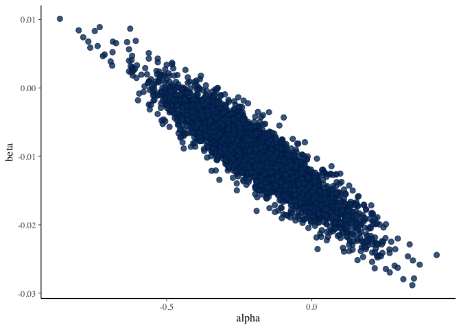
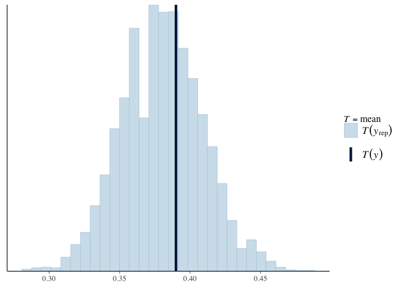
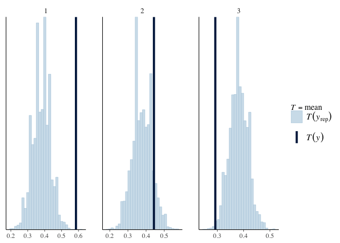
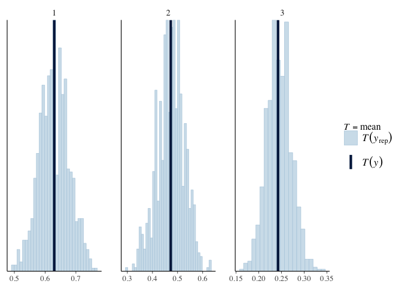

The Titanic Kaggle Challenge
================
Chris Bemben
9/5/2020

## Overview

Details of this Kaggle challenge can be found
[here](https://www.kaggle.com/c/titanic), the challenge is to accurately
predict whether a passenger survived or not. The response variable is
binary (1 or 0) since a passenger cannot partially survive. This
document will use the [Stan](https://mc-stan.org/) programming language
and logistic regression to attack the challenge.

    ## 'data.frame':    891 obs. of  12 variables:
    ##  $ PassengerId: int  1 2 3 4 5 6 7 8 9 10 ...
    ##  $ Survived   : int  0 1 1 1 0 0 0 0 1 1 ...
    ##  $ Pclass     : int  3 1 3 1 3 3 1 3 3 2 ...
    ##  $ Name       : Factor w/ 891 levels "Abbing, Mr. Anthony",..: 109 191 358 277 16 559 520 629 417 581 ...
    ##  $ Sex        : Factor w/ 2 levels "female","male": 2 1 1 1 2 2 2 2 1 1 ...
    ##  $ Age        : num  22 38 26 35 35 NA 54 2 27 14 ...
    ##  $ SibSp      : int  1 1 0 1 0 0 0 3 0 1 ...
    ##  $ Parch      : int  0 0 0 0 0 0 0 1 2 0 ...
    ##  $ Ticket     : Factor w/ 681 levels "110152","110413",..: 524 597 670 50 473 276 86 396 345 133 ...
    ##  $ Fare       : num  7.25 71.28 7.92 53.1 8.05 ...
    ##  $ Cabin      : Factor w/ 148 levels "","A10","A14",..: 1 83 1 57 1 1 131 1 1 1 ...
    ##  $ Embarked   : Factor w/ 4 levels "","C","Q","S": 4 2 4 4 4 3 4 4 4 2 ...

It’s a common anecdote that women and children were the first passengers
saved so the first model will only use age and gender as predictors.
Since there is a substantial number of missing age values, nulls will be
imputed, see this `Exploratory Data Analysis` vignette for the details
of the imputation methodology.

``` r
table(is.na(train$Age))
```

    ## 
    ## FALSE  TRUE 
    ##   714   177

``` r
train$Age[is.na(train$Age)] <- with(train, 
                                    ave(Age, Embarked, Pclass, 
                                        FUN = function(x) 
                                          median(x, na.rm = TRUE)))
table(is.na(test$Age))
```

    ## 
    ## FALSE  TRUE 
    ##   332    86

``` r
test$Age[is.na(test$Age)] <- with(test, 
                                    ave(Age, Embarked, Pclass, 
                                        FUN = function(x) 
                                          median(x, na.rm = TRUE)))
```

Now generate some sample data

``` r
simple_model <- stan_model('~/projectrepos/titanic/stan/mod001.stan')
```

``` r
simple_fit <- sampling(
  simple_model,
  data = list(N=nrow(train), y=train$Age),
  cores = 4,
  seed = 123
)
```

``` r
print(simple_fit, pars=c('mu','sigma'))
```

    ## Inference for Stan model: mod001.
    ## 4 chains, each with iter=2000; warmup=1000; thin=1; 
    ## post-warmup draws per chain=1000, total post-warmup draws=4000.
    ## 
    ##        mean se_mean   sd  2.5%   25%   50%   75% 97.5% n_eff Rhat
    ## mu    28.81    0.01 0.44 27.96 28.52 28.81 29.11 29.67  3488    1
    ## sigma 13.31    0.01 0.31 12.73 13.09 13.30 13.51 13.95  3387    1
    ## 
    ## Samples were drawn using NUTS(diag_e) at Sat Sep 19 22:21:58 2020.
    ## For each parameter, n_eff is a crude measure of effective sample size,
    ## and Rhat is the potential scale reduction factor on split chains (at 
    ## convergence, Rhat=1).

``` r
library(bayesplot)
samp <- rstan::extract(simple_fit)

hist(samp$y_rep, freq=FALSE)
```

<!-- -->

## Fit Logistic Regression

Age is only explanatory variable at this time.

``` r
age_logit_mod <- stan_model(file = '~/projectrepos/titanic/stan/mod002-logit.stan')
```

``` r
age_logit_fit <- sampling(
  age_logit_mod,
  data = list( N = nrow(train), 
               x = train$Age, 
               y = train$Survived, 
               N_new = nrow(test),
               cores = 4,
               x_new=test$Age),
  seed = 111
)
```

    ## 
    ## SAMPLING FOR MODEL 'mod002-logit' NOW (CHAIN 1).
    ## Chain 1: 
    ## Chain 1: Gradient evaluation took 0.000101 seconds
    ## Chain 1: 1000 transitions using 10 leapfrog steps per transition would take 1.01 seconds.
    ## Chain 1: Adjust your expectations accordingly!
    ## Chain 1: 
    ## Chain 1: 
    ## Chain 1: Iteration:    1 / 2000 [  0%]  (Warmup)
    ## Chain 1: Iteration:  200 / 2000 [ 10%]  (Warmup)
    ## Chain 1: Iteration:  400 / 2000 [ 20%]  (Warmup)
    ## Chain 1: Iteration:  600 / 2000 [ 30%]  (Warmup)
    ## Chain 1: Iteration:  800 / 2000 [ 40%]  (Warmup)
    ## Chain 1: Iteration: 1000 / 2000 [ 50%]  (Warmup)
    ## Chain 1: Iteration: 1001 / 2000 [ 50%]  (Sampling)
    ## Chain 1: Iteration: 1200 / 2000 [ 60%]  (Sampling)
    ## Chain 1: Iteration: 1400 / 2000 [ 70%]  (Sampling)
    ## Chain 1: Iteration: 1600 / 2000 [ 80%]  (Sampling)
    ## Chain 1: Iteration: 1800 / 2000 [ 90%]  (Sampling)
    ## Chain 1: Iteration: 2000 / 2000 [100%]  (Sampling)
    ## Chain 1: 
    ## Chain 1:  Elapsed Time: 1.02848 seconds (Warm-up)
    ## Chain 1:                0.644545 seconds (Sampling)
    ## Chain 1:                1.67302 seconds (Total)
    ## Chain 1: 
    ## 
    ## SAMPLING FOR MODEL 'mod002-logit' NOW (CHAIN 2).
    ## Chain 2: 
    ## Chain 2: Gradient evaluation took 6.7e-05 seconds
    ## Chain 2: 1000 transitions using 10 leapfrog steps per transition would take 0.67 seconds.
    ## Chain 2: Adjust your expectations accordingly!
    ## Chain 2: 
    ## Chain 2: 
    ## Chain 2: Iteration:    1 / 2000 [  0%]  (Warmup)
    ## Chain 2: Iteration:  200 / 2000 [ 10%]  (Warmup)
    ## Chain 2: Iteration:  400 / 2000 [ 20%]  (Warmup)
    ## Chain 2: Iteration:  600 / 2000 [ 30%]  (Warmup)
    ## Chain 2: Iteration:  800 / 2000 [ 40%]  (Warmup)
    ## Chain 2: Iteration: 1000 / 2000 [ 50%]  (Warmup)
    ## Chain 2: Iteration: 1001 / 2000 [ 50%]  (Sampling)
    ## Chain 2: Iteration: 1200 / 2000 [ 60%]  (Sampling)
    ## Chain 2: Iteration: 1400 / 2000 [ 70%]  (Sampling)
    ## Chain 2: Iteration: 1600 / 2000 [ 80%]  (Sampling)
    ## Chain 2: Iteration: 1800 / 2000 [ 90%]  (Sampling)
    ## Chain 2: Iteration: 2000 / 2000 [100%]  (Sampling)
    ## Chain 2: 
    ## Chain 2:  Elapsed Time: 0.945735 seconds (Warm-up)
    ## Chain 2:                0.690759 seconds (Sampling)
    ## Chain 2:                1.63649 seconds (Total)
    ## Chain 2: 
    ## 
    ## SAMPLING FOR MODEL 'mod002-logit' NOW (CHAIN 3).
    ## Chain 3: 
    ## Chain 3: Gradient evaluation took 7.9e-05 seconds
    ## Chain 3: 1000 transitions using 10 leapfrog steps per transition would take 0.79 seconds.
    ## Chain 3: Adjust your expectations accordingly!
    ## Chain 3: 
    ## Chain 3: 
    ## Chain 3: Iteration:    1 / 2000 [  0%]  (Warmup)
    ## Chain 3: Iteration:  200 / 2000 [ 10%]  (Warmup)
    ## Chain 3: Iteration:  400 / 2000 [ 20%]  (Warmup)
    ## Chain 3: Iteration:  600 / 2000 [ 30%]  (Warmup)
    ## Chain 3: Iteration:  800 / 2000 [ 40%]  (Warmup)
    ## Chain 3: Iteration: 1000 / 2000 [ 50%]  (Warmup)
    ## Chain 3: Iteration: 1001 / 2000 [ 50%]  (Sampling)
    ## Chain 3: Iteration: 1200 / 2000 [ 60%]  (Sampling)
    ## Chain 3: Iteration: 1400 / 2000 [ 70%]  (Sampling)
    ## Chain 3: Iteration: 1600 / 2000 [ 80%]  (Sampling)
    ## Chain 3: Iteration: 1800 / 2000 [ 90%]  (Sampling)
    ## Chain 3: Iteration: 2000 / 2000 [100%]  (Sampling)
    ## Chain 3: 
    ## Chain 3:  Elapsed Time: 1.13212 seconds (Warm-up)
    ## Chain 3:                0.661106 seconds (Sampling)
    ## Chain 3:                1.79323 seconds (Total)
    ## Chain 3: 
    ## 
    ## SAMPLING FOR MODEL 'mod002-logit' NOW (CHAIN 4).
    ## Chain 4: 
    ## Chain 4: Gradient evaluation took 7.7e-05 seconds
    ## Chain 4: 1000 transitions using 10 leapfrog steps per transition would take 0.77 seconds.
    ## Chain 4: Adjust your expectations accordingly!
    ## Chain 4: 
    ## Chain 4: 
    ## Chain 4: Iteration:    1 / 2000 [  0%]  (Warmup)
    ## Chain 4: Iteration:  200 / 2000 [ 10%]  (Warmup)
    ## Chain 4: Iteration:  400 / 2000 [ 20%]  (Warmup)
    ## Chain 4: Iteration:  600 / 2000 [ 30%]  (Warmup)
    ## Chain 4: Iteration:  800 / 2000 [ 40%]  (Warmup)
    ## Chain 4: Iteration: 1000 / 2000 [ 50%]  (Warmup)
    ## Chain 4: Iteration: 1001 / 2000 [ 50%]  (Sampling)
    ## Chain 4: Iteration: 1200 / 2000 [ 60%]  (Sampling)
    ## Chain 4: Iteration: 1400 / 2000 [ 70%]  (Sampling)
    ## Chain 4: Iteration: 1600 / 2000 [ 80%]  (Sampling)
    ## Chain 4: Iteration: 1800 / 2000 [ 90%]  (Sampling)
    ## Chain 4: Iteration: 2000 / 2000 [100%]  (Sampling)
    ## Chain 4: 
    ## Chain 4:  Elapsed Time: 1.14874 seconds (Warm-up)
    ## Chain 4:                0.75148 seconds (Sampling)
    ## Chain 4:                1.90022 seconds (Total)
    ## Chain 4:

``` r
age_logit_ext <- rstan::extract(age_logit_fit)

par(mfrow = c(3,1))
hist(age_logit_ext$alpha, main = 'alpha param')
hist(age_logit_ext$beta, main = 'beta param')
hist(age_logit_ext$y_rep, main = 'simulated survival')
```

<!-- -->

``` r
posterior <- as.array(age_logit_fit)
bayesplot::mcmc_scatter(posterior, pars=c("alpha","beta"))
```

<!-- -->

``` r
bayesplot::mcmc_intervals(posterior, pars=c("alpha","beta"))
```

<!-- -->

``` r
#https://discourse.mc-stan.org/t/posterior-prediction-from-logit-regression/12217/2
postDF <- as.data.frame(age_logit_ext$y_new)
bayesplot::ppc_stat(y = as.integer(train$Survived[1:418]), yrep = as.matrix(postDF), stat = mean)
```

<!-- -->

``` r
bayesplot::ppc_stat_grouped(y = as.integer(train$Survived[1:418]), yrep = as.matrix(postDF), stat = mean, group = train$Pclass[1:418])
```

<!-- --> The
passenger class shows heterogeneitiy across passenger class. However,
the model assumes the same suvivial rate across classes.

``` r
age_logit_hier_mod <- stan_model('~/projectrepos/titanic/stan/mod002-logit-hier.stan')
```

``` r
age_logit_hier_fit <- sampling(
              age_logit_hier_mod,
              data = list( N = nrow(train),
                           age = train$Age,
                           Pclass = 3,
                           pclass_idx = train$Pclass,
                           survival = train$Survived ),
              seed = 112,
              cores = 4)
```

The survival rate is similar to the actual data.

``` r
print(age_logit_hier_fit, pars = c('alpha','beta'))
```

    ## Inference for Stan model: mod002-logit-hier.
    ## 4 chains, each with iter=2000; warmup=1000; thin=1; 
    ## post-warmup draws per chain=1000, total post-warmup draws=4000.
    ## 
    ##           mean se_mean   sd  2.5%   25%   50%   75% 97.5% n_eff Rhat
    ## alpha[1]  1.89    0.01 0.29  1.36  1.69  1.89  2.08  2.48   953 1.01
    ## alpha[2]  0.97    0.01 0.25  0.49  0.79  0.97  1.13  1.45  1094 1.00
    ## alpha[3] -0.25    0.01 0.19 -0.61 -0.37 -0.25 -0.12  0.12   950 1.00
    ## beta     -0.04    0.00 0.01 -0.05 -0.04 -0.04 -0.03 -0.02   851 1.00
    ## 
    ## Samples were drawn using NUTS(diag_e) at Sat Sep 19 22:23:14 2020.
    ## For each parameter, n_eff is a crude measure of effective sample size,
    ## and Rhat is the potential scale reduction factor on split chains (at 
    ## convergence, Rhat=1).

``` r
age_logit_hier_ext <- rstan::extract(age_logit_hier_fit)
y_rep <- as.matrix(age_logit_hier_fit, pars = "y_rep")

ppc_stat_grouped(age_logit_hier_ext,
                 y = train$Survived,
                 yrep = y_rep[1:891,],
                 group = train$Pclass,
                 stat = "mean",
                 binwidth = 0.009)
```

<!-- -->

Predict with new data

``` r
beta_post <- age_logit_hier_ext$beta

# Function for simulating y based on new x
gen_quant_r <- function(age, Pclass) {
  alpha_post<- age_logit_hier_ext$alpha[,Pclass] #get intercept for class of passenger
  lin_comb <- sample(alpha_post, size = length(age)) + age*sample(beta_post, size = length(age))
  prob <- 1/(1 + exp(-lin_comb)) #inverse of logit link function
  out <- rbinom(length(age), 1, prob)
  return(out)
}

y_hat_tr <- gen_quant_r(train$Age, test$Pclass)
mean(y_hat_tr == train$Survived)
```

    ## [1] 0.5016835

generate predictions on the test data

``` r
#y_hat <- gen_quant_r(test$Age, test$Pclass)

# Accuracy
#pred_df <- data.frame(PassengerId = test$PassengerId, Survived=y_hat)
#write.csv(pred_df, file = "~/projectrepos/titanic/data/predict_20200918.csv", row.names = F)
```

## Appendix: Full Stan Programs

`mod001.stan`

    ## //
    ## // This Stan program defines a simple model, with a
    ## // vector of values 'y' modeled as normally distributed
    ## // with mean 'mu' and standard deviation 'sigma'.
    ## //
    ## // Learn more about model development with Stan at:
    ## //
    ## //    http://mc-stan.org/users/interfaces/rstan.html
    ## //    https://github.com/stan-dev/rstan/wiki/RStan-Getting-Started
    ## //
    ## 
    ## // The input data is a vector 'y' of length 'N'.
    ## data {
    ##   int<lower=0> N;
    ##   vector<lower=0>[N] y;
    ## }
    ## 
    ## // The parameters accepted by the model. Our model
    ## // accepts two parameters 'mu' and 'sigma'.
    ## parameters {
    ##   real<lower=0> mu;
    ##   real<lower=0> sigma;
    ## }
    ## 
    ## // The model to be estimated. We model the output
    ## // 'y' to be normally distributed with mean 'mu'
    ## // and standard deviation 'sigma'.
    ## model {
    ##   mu ~ normal(20, 2); // prior
    ##   sigma ~ uniform(0,100); //prior
    ##   y ~ normal(mu, sigma);
    ## }
    ## 
    ## generated quantities {
    ##   real y_rep = normal_rng(mu, sigma);
    ## }

`mod002-logit.stan`

    ## //
    ## // This Stan program defines a simple model, with a
    ## // vector of values 'y' modeled as normally distributed
    ## // with mean 'mu' and standard deviation 'sigma'.
    ## //
    ## // Learn more about model development with Stan at:
    ## //
    ## //    http://mc-stan.org/users/interfaces/rstan.html
    ## //    https://github.com/stan-dev/rstan/wiki/RStan-Getting-Started
    ## //
    ## 
    ## // The input data is a vector 'x' of length 'N'.
    ## data {
    ##   int<lower=0> N;
    ##   vector[N] x; // Age of passenger
    ##   int<lower=0,upper=1> y[N]; // survival outcome
    ##   
    ##   int<lower=0> N_new;
    ##   vector[N_new] x_new;
    ## }
    ## 
    ## // The parameters accepted by the model. Our model
    ## // accepts two parameters 'alpha' and 'beta'.
    ## parameters {
    ##   real alpha;
    ##   real beta;
    ## }
    ## 
    ## // The model to be estimated. We model the output
    ## // 'y' to be normally distributed with mean 'mu'
    ## // and standard deviation 'sigma'.
    ## model {
    ##   y ~ bernoulli_logit( alpha + beta * x );
    ## }
    ## 
    ## generated quantities {
    ##   vector[N_new] y_new;
    ##   int<lower=0,upper=1> y_rep[N];
    ##   for (n in 1:N)
    ##     y_rep[n] = bernoulli_logit_rng( alpha + beta * x[n]);
    ## 
    ##   for (n in 1:N_new)
    ##     y_new[n] = bernoulli_logit_rng( alpha + beta * x_new[n]);
    ## }

`mod002-logit-hier.stan`

    ## //
    ## // This Stan program defines a simple model, with a
    ## // vector of values 'y' modeled as normally distributed
    ## // with mean 'mu' and standard deviation 'sigma'.
    ## //
    ## // Learn more about model development with Stan at:
    ## //
    ## //    http://mc-stan.org/users/interfaces/rstan.html
    ## //    https://github.com/stan-dev/rstan/wiki/RStan-Getting-Started
    ## //
    ## 
    ## // The input data is a vector 'y' of length 'N'.
    ## data {
    ##   int<lower=0> N; // Number of obs
    ##   int<lower=0,upper=1> survival[N];
    ##   vector<lower=0>[N] age; 
    ##   
    ##   int<lower=0> Pclass; // Number of groups
    ##   int<lower=1, upper=Pclass> pclass_idx[N];
    ## }
    ## 
    ## // The parameters accepted by the model. Our model
    ## // accepts two parameters 'mu' and 'sigma'.
    ## parameters {
    ##   real beta; //coefficient on age
    ##   vector[Pclass] alpha;
    ##   
    ##  // vector[Pclass] mu;        // Passenger class-specific intercepts
    ##   //real<lower=0> sigma_mu;  // sd of passenger class-specific intercepts
    ##   //real phi;               // intercept of model for mu
    ## }
    ## 
    ## // The model to be estimated. We model the output
    ## // 'y' to be normally distributed with mean 'mu'
    ## // and standard deviation 'sigma'.
    ## model {
    ##   survival ~ bernoulli_logit( alpha[pclass_idx] + age * beta );
    ## }
    ## 
    ## generated quantities {
    ##   int y_rep[N];
    ##   for ( n in 1:N ) {
    ##     y_rep[n] = bernoulli_logit_rng( alpha[pclass_idx[n]] + age[n] * beta );
    ##   }
    ## }
